# Land-use and Land-cover Classification using EuroSAT Dataset
Project of Advanced Machine Learning (AML) Course for the Master in Data Science Program of Universitat Politècnica de Catalunya (UPC)
***

# Image Classification using CNNs

## Overview
This project explores various aspects of `Convolutional Neural Networks (CNNs)` and their applications to image classification tasks. The primary dataset used is the EuroSAT dataset for land-use and land-cover classification. The project is divided into the following tasks:

1. Custom CNN
2. Experiments
3. Interpretability
4. Transfer Learning
5. Open Project

**The whole analysis and the respective results of the subsequent tasks and subtasks are presented in the [final report](./docs/Deep_Learning_Tasks_and_Land_Use_Land_Cover_Classification_Using_EuroSAT_Dataset.pdf).**

## Tasks and Targets

### Task 1: Custom CNN
Created a CNN model on the [CIFAR10](https://www.cs.toronto.edu/~kriz/cifar.html) dataset. Then:
- Studied memory requirements and computational load of each layer.
- Reason the differences between layers of different types.

### Task 2: Experiments
By using the `Task 1` model, the impact of the following points was studied:
- Data augmentation.
- Size of training batch.
- Batch normalization.
- Forced overfit and solved it using any method to control the complexity of the model.

### Task 3: Interpretability
Using:
- The custom `CNN` used in `Tasks 1` and `2`.
- A pre-trained model: `VGG16`[^1].
- The `CIFAR10` dataset.

Visualize:
- `Filters`.
- `Activations`.

Got top k-samples per unit. Presented `t-SNE` plot on each of the `Dense/Linear/Fully Connected` layers. Provided semantic interpretation.

### Task 4: Transfer Learning
1. Trained a custom `CNN` over the [Terrassa 900 dataset](https://imatge.upc.edu/web/resources/terrassa-buildings-4126) (v.2019).
2. **Feature extractor**: Trained a custom `CNN` over `CIFAR-10` and then:
    - Removed the output layer.
    - Freezed all the model layers.
    - Trained a new output layer over the `Terrassa 900 dataset`.
    - Tested on the validation set.
3. **Fine-tuning**:
    - Took `VGG16, VGG19, ResNet50, ResNet152` models and replaced the last layers with new layers.
    - Trained the models by freezing the layers closer to the input layer.
    - Retrained the not frozen layers and the new ones over the `Terrassa 900 dataset`.
    - Tested it on the validation set.
4. **Extra fine-tuning**:
    - Took `VGG16, VGG19, ResNet50, ResNet152` models.
    - Replaced the last layers with a new small network.
    - Trained the model freezing part of the layers closer to the input layer on the concatenation of the [Paris building](https://www.robots.ox.ac.uk/~vgg/data/parisbuildings/) and `Terrassa 900` datasets.
    - Tested it on the validation set.


### Task 5: Land-use and Land-cover Classification using EuroSAT Dataset
By using the EuroSAT[^2] dataset (A Novel Dataset and Deep Learning Benchmark for Land Use and Land Cover Classification) performed the following tasks:
- Data exploration.
- Data preprocessing and preparation for usage with a `CNN`.
- Performed a resampling protocol adequate for DL.
- Created a `CNN` model and improved it to obtain a good classification score.
- Used `interpretability techniques` and gave semantic meaning to the model.
- Tested the model on unseen data, while the obtained results were studied by using a confusion matrix.
- Performed a post modeling analysis that includes which are the hardest classes to be predicted for the model, why is this the case, and if there is any bias in the predictions.

#### Overview of `Task 5` Results:

- The `EuroSAT`[^2] dataset includes the following classes:

    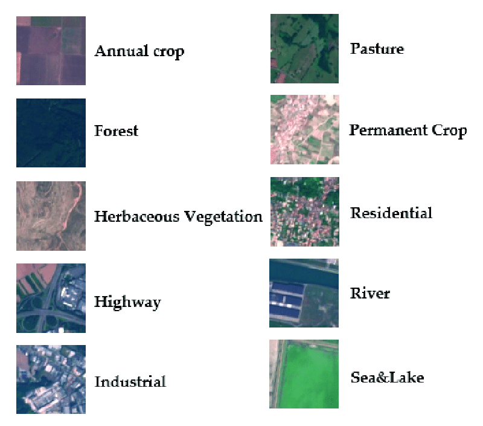
- with a sample distribution as follows:

    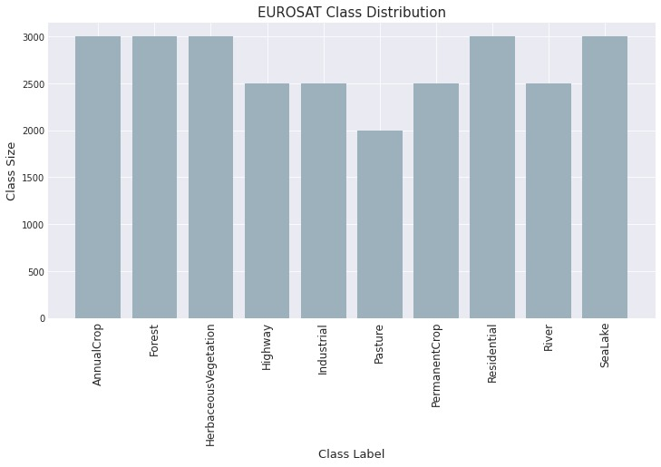
- The comparison of training and validation losses for `CustomCNN, VGG16, VGG19, ResNet50, ResNet152` models on the EuroSAT dataset is included here:

<p>
    <center><figure>
        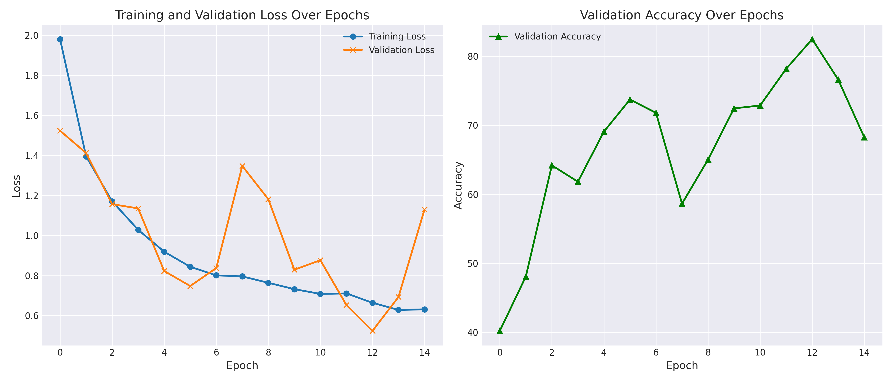
        <center><figcaption>Custom CNN Losses</figcaption></center>
    </figure>
    <figure>
        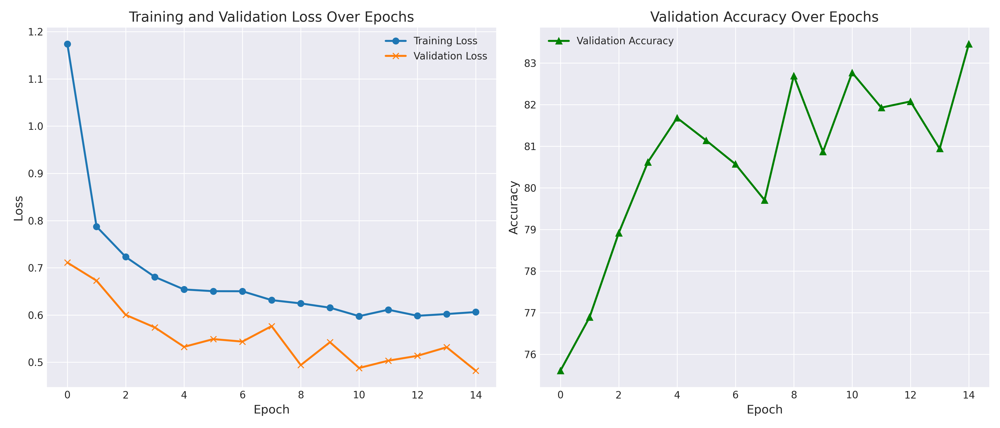
        <center><figcaption>ResNet50 Losses</figcaption></center>
    </figure>
    <figure>
        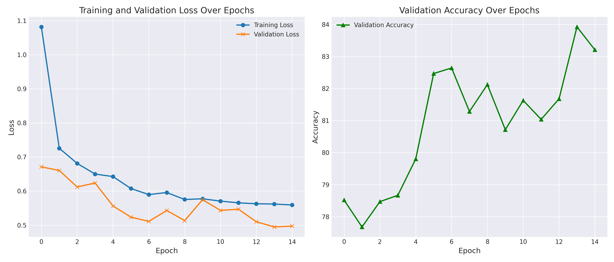
        <center><figcaption>ResNet152 Losses</figcaption></center>
    </figure>
    <figure>
        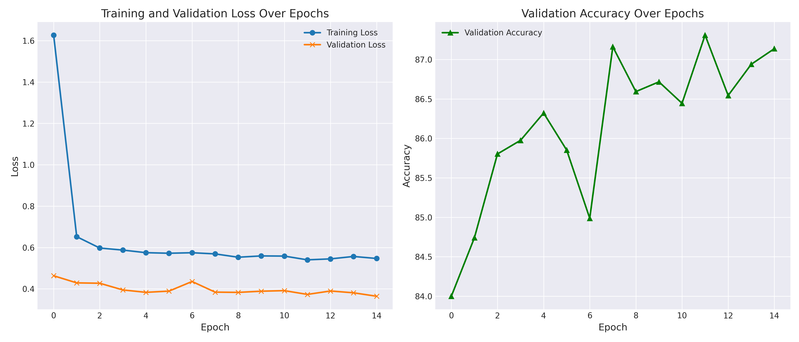
        <center><figcaption>VGG16 Losses</figcaption></center>
    </figure>
    <figure>
        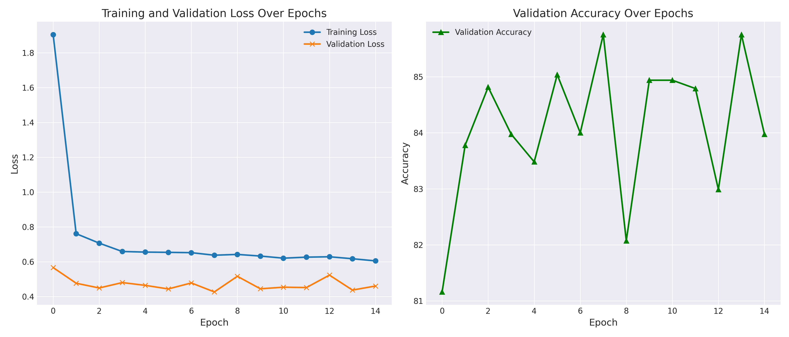
        <center><figcaption>VGG19 Losses</figcaption></center>
    </figure>
    </center>
</p>

- `VGG16` was selected as the final model since it was the one leading to the best performance. The model's detailed architecture is presented in file [VGG16 final architecture](./open_project/VGG16_final3/architecture_2024_01_11_22_13.txt). Its `confusion matrix` on the test set is presented here:

    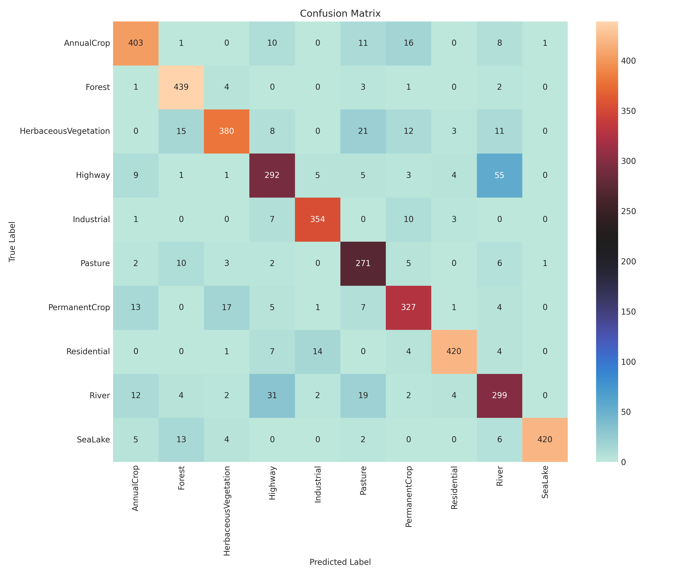.

- The `t-SNE visualizations` of the final model's activations across the dense layers is illustrated here:

<p>
  <center><figure>
    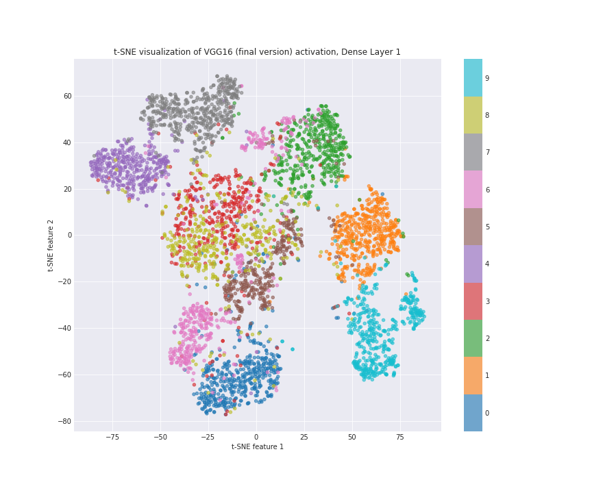
    <figcaption>Final t-SNE Plot for FC1</figcaption>
  </figure>
  <figure>
    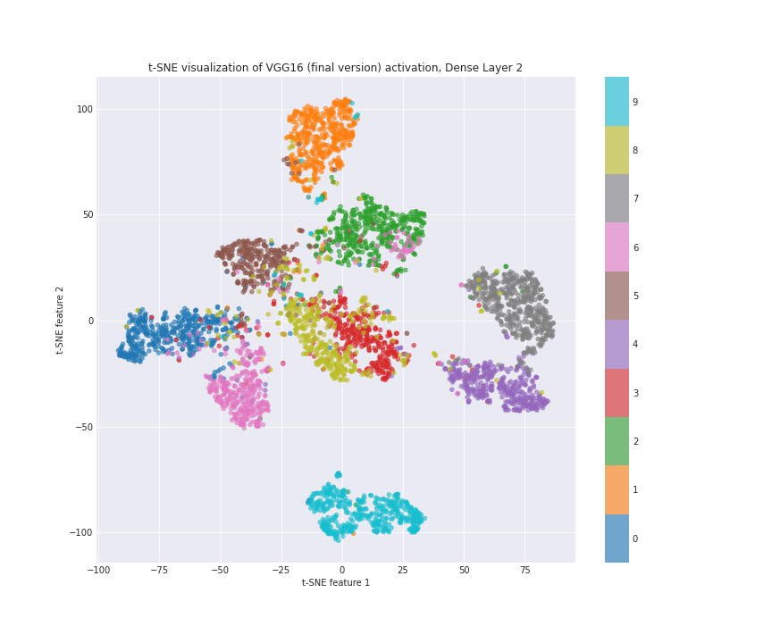
    <figcaption>Final t-SNE Plot for FC2</figcaption>
  </figure>
  <figure>
    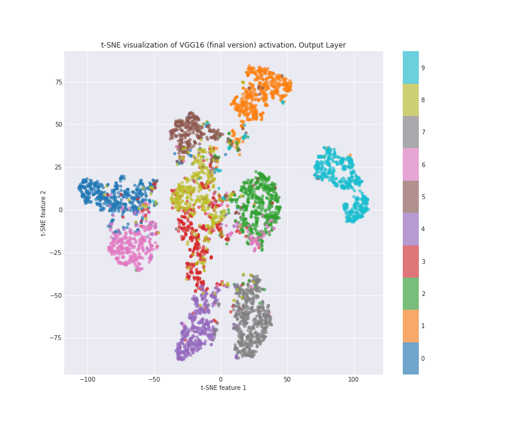
    <figcaption>Final t-SNE Plot for FC3</figcaption>
  </figure>
  </center>
</p>

- Finally, the `top 10` image examples for randomly selected units in each layer of the final model is included below:

<p>
  <center><figure>
    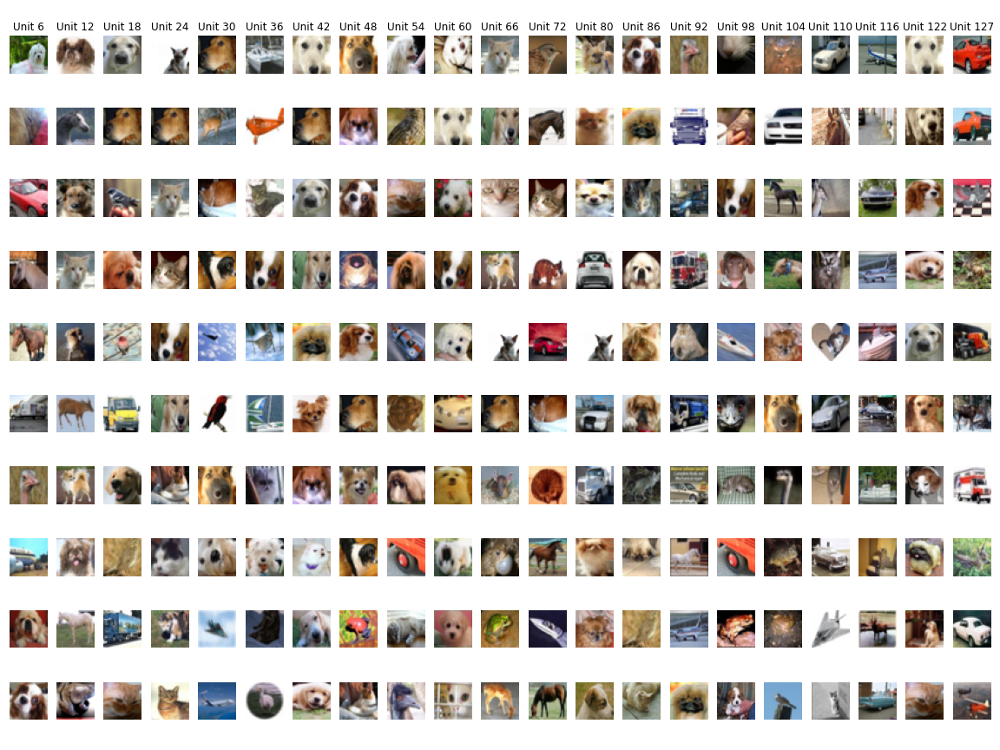
    <figcaption>VGG16 Top-10 Activations in FC1</figcaption>
  </figure>
  <figure>
    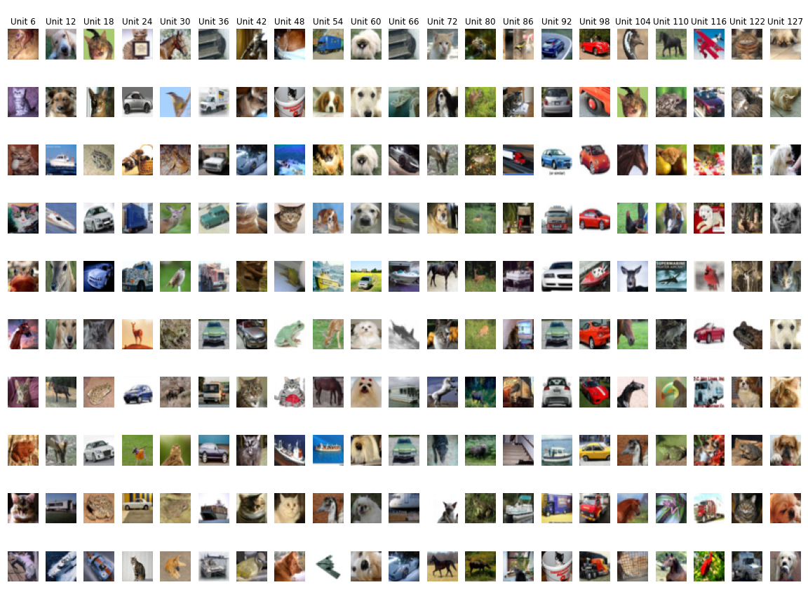
    <figcaption>VGG16 Top-10 Activations in FC2</figcaption>
  </figure>
  <figure>
    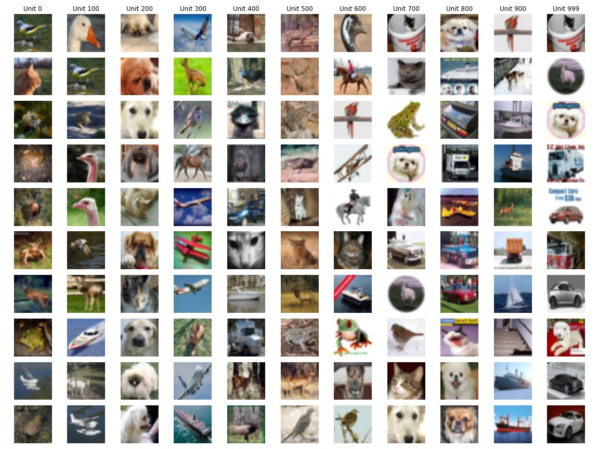
    <figcaption>VGG16 Top-10 Activations in FC3</figcaption>
  </figure>
  </center>
</p>

**ALL THE DETAILS OF THE IMPLEMENTATION AND INTERPRETATION OF RESULTS CAN BE FOUND IN [THE FINAL REPORT](./docs/Deep_Learning_Tasks_and_Land_Use_Land_Cover_Classification_Using_EuroSAT_Dataset.pdf), THE [SCRIPTS FOR EXPERIMENTS](./notebooks/) AND THE [FINAL PROJECT CODE](./open_project/)**.


## Install Dependencies

Project was developed with the usage of `Python 3.9.9`.

To install the required libraries use the following command:

``` bash
pip install -r requirements.txt
```


## Instructions for Executing Analysis Notebooks
* To execute the software the availability of an `NVIDIA GPU` is required.
* Install `CUDA` drivers
* Install dependencies
* Navigate to the `notebooks` folder included in the repository.
    * Execute the notebooks following the order of their names:
        * `1_Baseline_CNN_CIFAR.ipynb`
        * `2_Experiments.ipynb`
        * `3_Interpretability.ipynb`
        * `4_Transfer_learning.ipynb`
        * `5_Open_project.ipynb`


## Results
* Results of `Task1` are included directly in the executed notebook (`1_Baseline_CNN_CIFAR.ipynb`).
* Folder `task2-experiments` contain the results requested from `Task2` of the project.
* Folder `task3-visualizations` contain the results requested from `Task3` of the project.
* Folder `task4-losses` contain the results requested from `Task4` of the project.
* Folder `open-project` contain the results of the `Land-use and Land-cover Classification using EuroSAT Dataset` project requested for `Task5`.


[^1]: [https://arxiv.org/pdf/1409.1556](https://arxiv.org/pdf/1409.1556)
[^2]: [https://arxiv.org/abs/1709.00029](https://arxiv.org/abs/1709.00029)